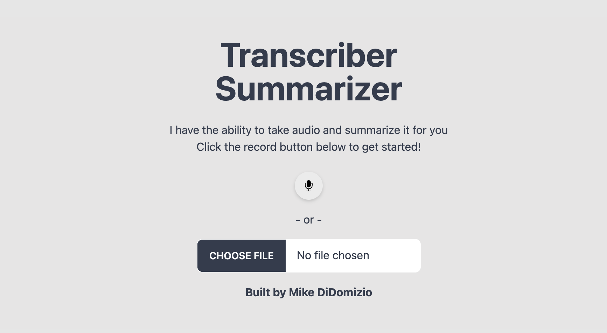

# Transcriber Summarizer

## What is this?

The purpose of this project was to:
- be able to record or upload audio
- have the application transcribe it and break it down by person
- Have OpenAI summarize it in bullet point or summary form

## Requirements

At this time, locally it requires

- AWS IAM account with Transcribe and S3 access
- OpenAI API key
